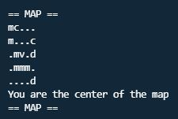
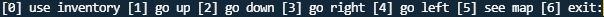
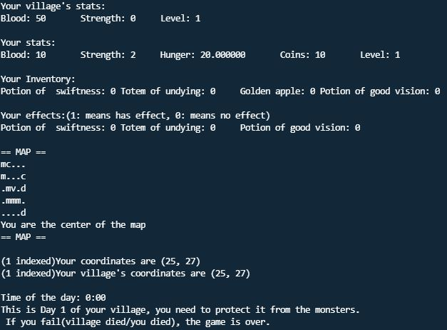
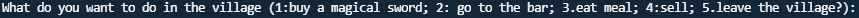
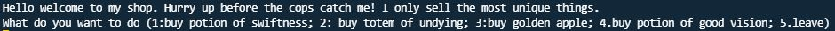
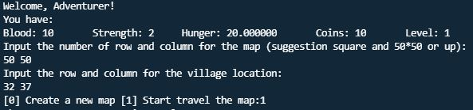
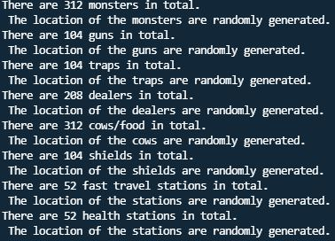
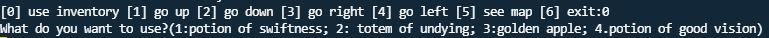



# 2d Fighting!!


Hello welcome to my game, you are the selected hero from your village to defend your village from monsters.


# Table of Contents

- [ReadMe - My Game Introduction](#readme---my-game-introduction)
- [Table of Contents](#table-of-contents)
- [Intro](#intro)
- [Prerequisites](#prerequisites)
  - [If your strength / hunger / coins = 0](#if-your-strength--hunger--coins--0)
- [How to play / Rules](#how-to-play--rules)
  - [Summary of the game](#summary-of-the-game)
- [Basic Interfaces](#basic-interfaces)
  - [Basic](#basic)
  - [Movement Interface](#movement-interface)
  - [After movement Interface](#after-movement-interface)
  - [Village Interface](#village-interface)
  - [Dealer's Shop Interface](#dealers-shop-interface)
  - [Inventory Interface](#inventory-interface)
- [Setup](#setup)
  - [Intro](#intro-1)
  - [Item setup](#item-setup)
- [Items in the game](#items-in-the-game)
  - [Player](#player)
    - [Inventory (How to use)](#inventory-how-to-use)
  - [Your Village](#your-village)
    - [What can you do inside the village](#what-can-you-do-inside-the-village)
  - [Dealer Shop](#dealer-shop)
    - [Things in the Dealer Shop](#things-in-the-dealer-shop)
      - [Potion of Swiftness](#potion-of-swiftness)
      - [Totem of Undying](#totem-of-undying)
      - [Golden Apple](#golden-apple)
      - [Potion of Good Vision](#potion-of-good-vision)
    - [How to use the items](#how-to-use-the-items)
  - [Monster](#monster)
  - [Food](#food)
  - [Guns / Shields / Traps](#guns--shields--traps)
  - [Fast Travel Stations](#fast-travel-stations)
  - [Health Stations](#health-stations)
- [Functions and Variables](#functions-and-variables)
  - [Variables](#variables)
    - [Monster stats](#monster-stats)
    - [Player Stats](#player-stats)
    - [Inventory](#inventory)
    - [Village Stats](#village-stats)
  - [Create Map](#create-map)
  - [Decide to travel or not](#decide-to-travel-or-not)
  - [Check for availability and boundaries](#check-for-availability-and-boundaries)
  - [Human typed setup](#human-typed-setup)
  - [Computer setup](#computer-setup)
  - [Encounters](#encounters)
  - [Check blood / strength / hunger / if survive new day](#check-blood--strength--hunger--if-survive-new-day)
  - [Player Movement](#player-movement)
  - [Print out map / important stats](#print-out-map--important-stats)
- [Version](#version)

# Intro

You are the selected hero from your village to defend your village from monsters around it. You always dreamed to be the hero of the village since young. Now it's time for you to shine. Prepare for all kinds of adventures, monsters, traps, you will encounter. All that you know is that this is hard, but you know that *`with great power comes great responsibility`*. So you must go on and defend your village. Be the hero. Wish you good luck!

(*Note: you must go before the dark as nearby monsters attack your village at night.*)


# Prerequisites

You are given *`at most a 5*5 map`* since your village don't have a lot of paper to make you a map.

For Example: 


1. Your default stats (Player)
+ Blood: 10
+ Strength: 2
+ Hunger: 20
+ Coins: 10 
+ Level: 1

2. Your village's default stats
+ Blood: 50
+ Strength: 0 
+ Level: 1

## If your strength / hunger / coins = 0
If you don't have enough hunger or strength the next time you lose either of them you will lose blood. But if you don't have enough coins (coins = 0), your coins will just be 0 if you lose them next time.

# How to play / Rules

You start from day 1 of defending the village.
When you `move 1 spot`, it takes a hour and your `hunger will be deducted 1`. So, in **`a day`**, you can only take `24 steps` (unless you have [potion of swiftness](#potion-of-swiftness) ) before it gets dark.
When it's `night` time, your `village` will be `attacked by nearby monsters` (if you can see them from the map in the village's perpective means is nearby) 
>For Example: 


>>village's perspective means the village is in the middle of the map

*each nearby `monster` will have `10 damage times days you survived` to the village*. Once the *`night is over`* and you and your village are both ***`still alive`*** everything will *reallocate* to their new places *except you and your village*. This will *`start a whole new day`* of defending your village with new and more unexpected things to come. Your `default blood` will be `added to 20`. Your `village` will become stronger with `50 more blood`.
***`But`*** if the `village falls down` or 'you died' during the day, you fail your mission, and the ***`game is over`***.

For example (after the night stats):
1. Your day 2 stats (best condition) (Player)
+ Blood: 20
+ Strength: 2
+ Hunger: 20
+ Coins: 10 
+ Level: 2

2. Your village's day 2 (best condition) stats
+ Blood: 100
+ Strength: 0 
+ Level: 2

## Summary of the game
You and your village can't fall down.

# Basic Interfaces
## Basic
There are two main kinds of spot in the game. One is '.' and others.
| Spots in map | Status |
| ------ | ----------- |
| '.'(dot) / 'p' | normal |
| 'm' / 's' / 'f' / 'c' / 'h'...(even hidden ones) | special |

Whenever you see a map, *`you are in the dead center of the map`*. If you don't see 'p' doesn't mean you are not on the map, it's just that you are standing on a special spot.
## Movement Interface
Ask which direction to go or you want to [use inventory](#inventory-how-to-use) or see map or quit game.


## After movement Interface
Each time after you move you will be given all kinds of information.
1. Village's stats
2. Your stats
3. What is in your inventory
4. Effects on you
5. Map
6. Coordinate (Yours and Village's)
7. Time of the day
8. Small reminder
   

## Village Interface
Ask what you want to do in the [village](#what-can-you-do-inside-the-village)


## Dealer's Shop Interface
Ask what you want to do in the [dealer's_shop](#dealer-shop)



## Inventory Interface
see [inventory_interface](#inventory-how-to-use)
# Setup
## Intro
The game will first welcome adventurer and give you your stats. And then it will ask you to input the rows and columns of the map (suggestion: square and 50*50 or up) and then it will ask you to input the coordinates of the village. Then, you can choose to create a new map or start playing. You always `start from the village`.


## Item setup
| Items | How Many |
| ------ | ----------- |
| [Player](#player)  | one |
| [Village](#your-village) | one |
| [Dealer](#dealer-shop)  | map size * 1/12 |
| [Monster](#monster)  | map size * 1/8 |
| [Food](#food)  | map size * 1/8 |
| [Guns](#guns--shields--traps)  | map size * 1/24 |
| [Shield](#guns--shields--traps)  | map size * 1/24 |
| [Traps](#guns--shields--traps)  | map size * 1/24 |
| [Fast Travel Stations](#fast-travel-stations)  | map size * 1/48 |
| [Health Stations](#health-stations)  | map size * 1/48 |
For example: a 50*50 map 

* The location of the items are randomly generated except for the village.

# Items in the game
## Player
Is you

Is `'p'` on the map

see [stats](#prerequisites)

### Inventory (How to use)
Before you move, you can always use your inventory. You just need to type '0' and you can use it.



## Your Village
Is `'v'` on the map

see [stats](#prerequisites)
### What can you do inside the village
1. Buy a magical sword
   
   Each sword is *3 coins* and will give you *1 strength*. You can only *buy once per visit*.
2. Go to the bar

    You can drink beer in the bar which will give you *+1 blood*. Each beer is worth *2 coins* and you can drink till you are back to health.
3. Eat a meal
   
   Each meal is worth *5 coins* and will give you *+5 hunger*. You can eat till you're full.
4. Sell things 

    You can sell things from your inventory but each thing is only `sold for 5 coins`.

## Dealer Shop
Is `'d'` on the map

The dealer shop is like a black market. It can highly improve your game. It sells unique things that you can't normally buy in your village. But because of this you can only buy stuff from this dealer shop once. Once you leave the shop you can only visit other shops in other locations, the shop you visited will `disappear` to avoid being arrested by the cops (there are actually no cops in this game, it is just to tell you that it is like a black market, and it will not be in the same location after you leave).

### Things in the Dealer Shop

#### Potion of Swiftness
Makes you go faster, you can walk two steps at a time with only `-1 hunger`. *Effect lasts till the day ends*. Costs `25 coins`.
#### Totem of Undying
You won't die if you have this. It will give you `+5 blood` when in need.
Costs `50 coins`.
#### Golden Apple
When you eat it, it will give you `+5 blood and +5 hunger`.
Costs `55 coins`.
#### Potion of Good Vision
You can see `11 * 11 map` everytime you see the map. *Effect lasts till the end of the day*.
Costs `30 coins`.

### How to use the items
You have to go in your inventory (see [how to use inventory ](#inventory-how-to-use)) and use it then the item will be in effect.
For example, you want to use the totem of undying, go in your inventory and use it then it will be in effect otherwise no.
* You can buy a lot of them but only use 1 of them (only 1 can be in effect)
## Monster
Is `'m'` on the map

There are four levels of monsters. When you `encounter` a monster, the `levels` of the monsters are `randomly generated`. You then can *choose to fight or not to fight*. If you choose to `fight` your `hunger` will first be `deducted by the monster's strength`, as you will need tired and hungry after the fight.

| Monsters | Stats (Day 1) (Default) |
| ------ | ----------- |
| Lv. 1  | Blood: 1 Strength: 1 Coins:  5 |
| Lv. 2  | Blood: 2 Strength: 2 Coins: 10 |
| Lv. 3  | Blood: 3 Strength: 3 Coins: 15 |
| Lv. 4  | Blood: 4 Strength: 4 Coins: 20 |
* Monster's Stats  =  Default Stats * (Days you survived) . For example, on day 2, a lv.2 monster will have 4 blood, 4 strength, and 20 coins. 
* When you encounter a monster, each `monster's evasion rate` will be `randomly generated`, and when a monster `successfully` evaded your attack, it will `attack back` (will lose blood). If it `didn't evade`, it means you attacked successfully if your `attack is greater than their blood`. You will `get` the `coins` and your `strength` will be `added 1`, but if your attack is `lesser` than their blood, it means you `lost`, and `you` will be `attacked` (will lose blood). The monster won't go anywhere if you lose, so you can always come back again(may be different level). But the monster will disappear if you win, because you just killed it.
  
## Food
Is `'c'` on the map, as it stands for chicken or cow

When you encounter a "food", you can eat it, and your hunger will be `added 2`. If you are already full, then the game will say you are full and you don't need to eat it (to save animals). But the animal will go nowhere so you can come back anytime. But if you are almost full (if +2 hunger will be greater than 20 hunger) then you will only be added to 20 hunger.

## Guns / Shields / Traps
They are all over the map, but hided from you( can't see from map ) . Each '.' may be a gun, shield, or a trap, so walk with caution.
After you stepped on it, it will disappear (not in the same location).
| Hidden Items | Description |
| ------ | ----------- |
| Guns  | Will give you strength. ( strength +1 ) |
| Shield  | Will give you protection ( blood+1 ). |
| Trap 1  | Will lose 1 blood and 1 strength|
| Trap 2 | Will lose coins |
* The amount of coins you lose is somewhere between 0 to half your amount (random). So don't be worried.
* If you don't have any strength (strength = 0) then the next time you lose strength you will lose blood. see [if your strength/hunger/coins = 0](#if-your-strength--hunger--coins--0) for more info
  
## Fast Travel Stations
Is `'f'` on the map
They can help you `travel back to the village` right away if you want.

## Health Stations
Is `'h'` on the map
It will give you `+1 blood`. But if you are already healthy, you don't need it.

# Functions and Variables
## Variables
### Monster stats
``` c
typedef struct
{
    int blood;
    int strength;
    int coins;
    int level;
    int evasionRate;
} info; 
//for monster
``` 
### Player Stats
``` c
typedef struct
{
    int default_blood;
    int blood;
    int strength;
    double hunger;
    int coins;
    int level;
    int rp;           // player row coordinate
    int cp;           // player column coordinate
    int rv;           // village row coordinate
    int cv;           // village column coordinate
    int boot;         // for calculating time of the day
    int day;          // what day it is
    inventory things; // like backpack
    inventory effect; // what effects are on me
} adventurer;
// for hero
``` 
### Inventory
```c
typedef struct
{
    int potion_of_swiftness;
    int totem_of_undying;
    int golden_apple;
    int potion_of_good_vision;
} inventory;
//inventory
```
### Village Stats
```c
typedef struct
{
    int blood;
    int strength;
    int level;
} village;
// for village
```
## Create Map
``` c
char **create_map(int *row, int *col)
{
    //ask for row and col
    printf("Input the number of row and column for the map (suggestion square and 50*50 or up):\n");
    scanf("%d %d", row, col);

    //malloc
    char **arr = (char **)malloc(*row * sizeof(char *));
    for (int i = 0; i < *row; i++)
        arr[i] = (char *)malloc(*col * sizeof(char));

    //set all to '.'
    for (int i = 0; i < *row; i++)
        for (int j = 0; j < *col; j++)
            arr[i][j] = '.';
    return arr;
}
```
## Decide to travel or not
```c
int travel_decide()
{
    int decide; // decide to create a new map or travel
    printf("[0] Create a new map [1] Start travel the map:");
    scanf("%d", &decide);
    return decide;
}
```
## Check for availability and boundaries
  1. Human input check
     * Check boundary
       ```c
       int check_boundary(int *row, int *col, int r, int c) // row temp and col temp to see if input is in the correct range
       {
           if (r >= *row || r < 0 || c >= *col || c < 0)
           {
               printf("the location is  outside the map\n");
               return 1; // true
           }
           else
               return 0; // false
       }
       ```
      * Check availability
          ```c
          int check_availability(char **map, int *row, int *col, int r, int c)
          {
              if (map[r][c] !='.') // check if occupied
              {
                  printf("the location is occupied\n");
                  return 1; // true
              }
              else
                  return 0; // false
          }
          ```
  2. Computer input
   
   only need to check availability cause computer won't input a row or column out of range (I coded it)
   * Check availability
        ```c
        int comp_check_availability(char **map, int *row, int *col, int r, int c)
        {
            if (map[r][c] != '.') // check if occupied
                return 1;         // true
            else
                return 0; // false
        }
        ```
## Human typed setup
  1. setup village coordinates
     ```c
     void setup_village(char **map, int *row, int *col, adventurer *hero) // input village coordinates
      {
          printf("Input the row and column for the village location:\n");
          scanf("%d %d", &hero->rv, &hero->cv);
          if (check_boundary(row, col, hero->rv, hero->cv))//check if out of range
              setup_village(map, row, col, hero);//if yes then call the function again
          map[hero->rv][hero->cv] = 'v';//otherwise set coordinate to 'v'
      }
      ```
  2. setup player coordinates
    ```c
    hero.rp = hero.rv; // player row = village row
    hero.cp = hero.cv; // player column = village column
    ```
## Computer setup
  1. setup [dealer](#dealer-shop)
      ```c
      void setup_dealer(char **map, int *row, int *col)
      {
          int dealers_num = (*row) * (*col) * 1 / 12; // setup how many
          printf("There are %d dealers in total.\n The location of the dealers are randomly generated.\n", dealers_num);
          for (int i = 0; i < dealers_num;)
          {
              int rowd, cold;                                         // dealer row and dealer column
              rowd = rand() % (*row);                                 // random generate row
              cold = rand() % (*col);                                 // random generate column
              if (comp_check_availability(map, row, col, rowd, cold)) // check if available, if not random again
                  continue;
              i++;                   // put here so if continue 'i' will not plus 1
              map[rowd][cold] = 'd'; // set coordinates to dealer
          }
      }
      ```
  2. setup [monster](#monster)
      ```c
      void setup_monster(char **map, int *row, int *col) // input monster coordinates
      {
          int monster_num = (*row) * (*col) * 1 / 8; // how many monsters
          printf("There are %d monsters in total.\n The location of the monsters are randomly generated.\n", monster_num);
          for (int i = 0; i < monster_num;) // check input and coordinates for monster(s)
          {
              int rowm, colm;                                         // monster row and monster column
              rowm = rand() % (*row);                                 // random generate row
              colm = rand() % (*col);                                 // random generate column
              if (comp_check_availability(map, row, col, rowm, colm)) // check if available, if not random again
                  continue;
              i++;                   // put here so if continue 'i' will not plus 1
              map[rowm][colm] = 'm'; // set coordinates to monster
          }
      }
      ```
  3. setup [food](#food)
      ```c
      void setup_food(char **map, int *row, int *col) // input cow coordinates
      {
          int food_num = (*row) * (*col) * 1 / 8; // how many chicken/cow
          printf("There are %d cows/food in total.\n The location of the cows are randomly generated.\n", food_num);
          for (int i = 0; i < food_num;)
          {
              int rowf, colf;                                         // food row and food column
              rowf = rand() % (*row);                                 // random generate row
              colf = rand() % (*col);                                 // random generate column
              if (comp_check_availability(map, row, col, rowf, colf)) // check if available, if not random again
                  continue;
              i++;                   // put here so if continue 'i' will not plus 1
              map[rowf][colf] = 'c'; // set coordinates to food
          }
      }
      ```
  4. setup [gun](#guns--shields--traps)
      ```c
      void setup_gun(char **map, int *row, int *col)
      {
          int gun_num = (*row) * (*col) / 24; // how many guns
          printf("There are %d guns in total.\n The location of the guns are randomly generated.\n", gun_num);
          for (int i = 0; i < gun_num;)
          {
              int rowg, colg;                                         // gun row and gun col
              rowg = rand() % (*row);                                 // random genrate row;
              colg = rand() % (*col);                                 // random genrate col
              if (comp_check_availability(map, row, col, rowg, colg)) // check if available, if not random again
                  continue;
              i++;                   // put here so if continue 'i' will not plus 1
              map[rowg][colg] = 'g'; // set coordinates to guns for computer but map will not show(hidden)
          }
      }
      ```
  5. setup [shield](#guns--shields--traps)
      ```c
      void setup_shield(char **map, int *row, int *col)
      {
          int shield_num = (*row) * (*col) / 24; // how many shields
          printf("There are %d shields in total.\n The location of the shields are randomly generated.\n", shield_num);
          for (int i = 0; i < shield_num;)
          {
              int rows, cols;                                         // shield row and shield col
              rows = rand() % (*row);                                 // random genrate row;
              cols = rand() % (*col);                                 // random genrate col
              if (comp_check_availability(map, row, col, rows, cols)) // check if available, if not random again
                  continue;
              i++;                   // put here so if continue 'i' will not plus 1
              map[rows][cols] = 's'; // set coordinates to shields for computer but map will not show(hidden)
          }
      }
      ```
  6. setup [traps](#guns--shields--traps)
      ```c
      void setup_trap(char **map, int *row, int *col)
      {
          int trap_num = (*row) * (*col) / 24; // how many traps
          printf("There are %d traps in total.\n The location of the traps are randomly generated.\n", trap_num);
          for (int i = 0; i < trap_num;)
          {
              int rowt, colt;                                         // trap row and trap col
              rowt = rand() % (*row);                                 // random genrate row;
              colt = rand() % (*col);                                 // random genrate col
              if (comp_check_availability(map, row, col, rowt, colt)) // check if available, if not random again
                  continue;
              i++;                   // put here so if continue 'i' will not plus 1
              map[rowt][colt] = 't'; // set coordinates to traps for computer but map will not show(hidden)
          }
      }
      ```
  7. setup [fast travel stations](#fast-travel-stations)
      ```c
      void setup_fast_travel(char **map, int *row, int *col)
      {
          int fast_travel_num = (*row) * (*col) * 1 / 48; // how many fast travel stations
          printf("There are %d fast travel stations in total.\n The location of the stations are randomly generated.\n", fast_travel_num);
          for (int i = 0; i < fast_travel_num;)
          {
              int rowf, colf;                                         // fast travel row and fast travel col
              rowf = rand() % (*row);                                 // random genrate row;
              colf = rand() % (*col);                                 // random genrate col
              if (comp_check_availability(map, row, col, rowf, colf)) // check if available, if not random again
                  continue;
              i++;                   // put here so if continue 'i' will not plus 1
              map[rowf][colf] = 'f'; // set coordinates to fast travel stations
          }
      }
      ```
  8. setup [health stations](#health-stations)
    ```c
    void setup_clinic(char **map, int *row, int *col)
    {
        int clinic_num = (*row) * (*col) * 1 / 48; // how many health stations
        printf("There are %d health stations in total.\n The location of the stations are randomly generated.\n", clinic_num);
        for (int i = 0; i < clinic_num;)
        {
            int rowh, colh;                                         // health row and health col
            rowh = rand() % (*row);                                 // random genrate row;
            colh = rand() % (*col);                                 // random genrate col
            if (comp_check_availability(map, row, col, rowh, colh)) // check if available, if not random again
                continue;
            i++;                   // put here so if continue 'i' will not plus 1
            map[rowh][colh] = 'h'; // set coordinates to health stations
        }
    }
    ```
## Encounters
  1. Encounter [village](#your-village)
      * buy sword 
      see [what can you do inside the village](#what-can-you-do-inside-the-village) for more info
          ```c
          if (count_sword >= 1) // already bought once during this visit
          {
              printf("You already brought a sword.\n");
              break;
          }
          else
          {
              printf("The magical sword is %d coins\n", sword.coins); // show how much sword is
              printf("Do you want to buy it? [0]No [1]Yes:\n");
              int decide; // decide to buy or not
              scanf("%d", &decide);
              if (!decide) // decide no
                  break;
              if (!check_coins(hero, sword.coins)) // otherwise if yes then check if you have enough money to buy
                  break;
              hero->coins -= sword.coins;                                                                  // if yes then buy
              (hero->strength)++;                                                                          // strength+1
              printf("Nice sword! Now you have %d strength and %d coins!\n", hero->strength, hero->coins); // compliment
              count_sword++;                                                                               // bought sword 1 time
              break;
          }
          ```
      * go to the bar  
      see [what can you do inside the village](#what-can-you-do-inside-the-village) for more info
          ```c
          if ((hero->blood) >= hero->default_blood) // check if blood is full
          {
              printf("Your blood is full. You don't need a beer.\n");
              break;
          }
          else
          {
              printf("The magical beer is %d coins\n", beer.coins); // show how much one beer is
              printf("Do you want to buy it? [0]No [1]Yes:\n");
              int decide; // decide to buy or not
              scanf("%d", &decide);
              if (!decide) // decide no
                  break;
              if (!check_coins(hero, beer.coins)) // check if enough money to buy
                  break;
              hero->coins -= beer.coins;
              (hero->blood)++;                                                                      // blood +1
              printf("Nice beer! Now you have %d blood and %d coins!\n", hero->blood, hero->coins); // compiment
              break;
          }
          ```
      * eat meal
      see [what can you do inside the village](#what-can-you-do-inside-the-village) for more info
          ```c
          if ((hero->hunger) >= 20) // check if full
          {
              printf("You are full. You don't need a meal.\n");
              break;
          }
          else
          {
              int meal_coins = 5;                                    // one meal cost 5 coins
              printf("The magical feast is %d coins\n", meal_coins); // show how much
              printf("Do you want to buy it? [0]No [1]Yes:\n");
              int decide; // decide to buy or not
              scanf("%d", &decide);
              if (!decide) // decide no
                  break;
              if (!check_coins(hero, meal_coins)) // check if enough coins to buy
                  break;
              hero->coins -= meal_coins;
              (hero->hunger) += 10;   // hunger +10
              if (hero->hunger > 20) // add to full
                  hero->hunger = 20;
              printf("Nice meal! Now you have %lf hunger and %d coins!\n", hero->hunger, hero->coins); // compiment
              break;
          }
          ```
      * sell 
      see [what can you do inside the village](#what-can-you-do-inside-the-village) for more info
          ```c
          while (1)
          {
              printf("What do you want to sell?(1:sell potion of swiftness; 2: sell totem of undying; 3:sell golden apple; 4.sell potion of good vision; 5:leave)\n(Note: each item is sold for 5 coins no matter what)\n"); // ask what to sell
              int decide;
              scanf("%d", &decide);
              switch (decide)
              {
              case 1:                                        // sell potion of swiftness
                  if (hero->things.potion_of_swiftness == 0) // check if you have it
                  {
                      printf("You don't have it, stop scamming your village.\n");
                      break;
                  }
                  hero->things.potion_of_swiftness--;           // sold
                  hero->coins += 10;                            // add 10 coins
                  printf("Now you have %d coins", hero->coins); // show how many coins left
                  break;
              case 2:                                     // sell totem of undying
                  if (hero->things.totem_of_undying == 0) // check if you have it
                  {
                      printf("You don't have it, stop scamming your village.\n");
                      break;
                  }
                  hero->things.totem_of_undying--;              // sold
                  hero->coins += 10;                            // add 10 coins
                  printf("Now you have %d coins", hero->coins); // show how many coins left
                  break;
              case 3:                                 // sell golden apple
                  if (hero->things.golden_apple == 0) // check if you have it
                  {
                      printf("You don't have it, stop scamming your village.\n");
                      break;
                  }
                  hero->things.golden_apple--;                  // sold
                  hero->coins += 10;                            // add 10 coins
                  printf("Now you have %d coins", hero->coins); // show how many coins left
                  break;
              case 4:                                          // sell potion of good vision
                  if (hero->things.potion_of_good_vision == 0) // check if you have it
                  {
                      printf("You don't have it, stop scamming your village.\n");
                      break;
                  }
                  hero->things.potion_of_good_vision--;         // sold
                  hero->coins += 10;                            // add 10 coins
                  printf("Now you have %d coins", hero->coins); // show how many coins left
                  break;
              case 5:
                  printf("Thanks for selling\n"); // say bye bye
                  break;
              default: // invalid action
                  printf("Invalid action!\n");
                  break;
          }
          ```
      * leave
      ```c
      case 5: // leave
          printf("You are welcome to come back anytime!\n");
          return;
      default: // invalid action
          printf("Invalid action! 1:buy a magical sword; 2: go to the bar; 3.eat meal; 4:sale; 5.leave the village\n");
          break;
      ```
  2. Encounter [dealer](#dealer-shop)
      ```c
      void encounter_dealer(adventurer *hero)
      {
          // count the times you buy something
          int count_one = 0;
          int count_two = 0;
          int count_three = 0;
          int count_four = 0;
          printf("Hello welcome to my shop. Hurry up before the cops catch me! I only sell the most unique things.\n"); // welcome
          while (1)
          {
              printf("What do you want to do (1:buy potion of swiftness; 2: buy totem of undying; 3:buy golden apple; 4.buy potion of good vision; 5.leave)\n"); // ask what to buy

              // how much
              int potion_of_swiftness = 25;
              int totem_of_undying = 55;
              int golden_apple = 50;
              int potion_of_good_vision = 30;

              // decide
              int dowhat;
              scanf("%d", &dowhat);
              switch (dowhat)
              {
                  case 1:                 // buy potion of swiftness
                      if (count_one >= 1) // check if you already bought once during the visit
                      {
                          printf("You already brought it.\n");
                          break;
                      }
                      else
                      {
                          printf("The potion of swiftness is %d coins\n(last for 1 day)", potion_of_swiftness); // description
                          printf("Do you want to buy it? [0]No [1]Yes:\n");
                          int decide; // decide to buy or not
                          scanf("%d", &decide);
                          if (!decide) // decide no
                              break;
                          if (!check_coins(hero, potion_of_swiftness)) // check if you have enough money
                              break;
                          hero->coins -= potion_of_swiftness; // sold
                          hero->things.potion_of_swiftness++;
                          printf("Nice! Now you can 2 times speed, but only cost 1 hunger.\n"); // description
                          count_one++;                                                          // count++
                          break;
                      }
                  case 2:
                      if (count_two >= 1) // check if you already bought once during the visit
                      {
                          printf("You already brought it.\n");
                          break;
                      }
                      else
                      {
                          printf("The totem of undying is %d coins(Note: can only use one time, after buying it you have to hold/use it to have the effect)\n", totem_of_undying); // description
                          printf("Do you want to buy it? [0]No [1]Yes:\n");
                          int decide; // decide to buy or not
                          scanf("%d", &decide);
                          if (!decide) // decide no
                              break;
                          if (!check_coins(hero, totem_of_undying)) // check if you have enough money
                              break;
                          hero->coins -= totem_of_undying; // sold
                          hero->things.totem_of_undying++;
                          printf("Nice! Now if you are strike to death, you will have 5 more blood.\n"); // description
                          count_two++;                                                                   // count++
                          break;
                      }
                  case 3:
                      if (count_three >= 1) // check if you already bought once during the visit
                      {
                          printf("You already brought it.\n");
                          break;
                      }
                      else
                      {
                          printf("The golden apple is %d coins(Note: can only use one time)\n", golden_apple); // description
                          printf("Do you want to buy it? [0]No [1]Yes:\n");
                          int decide; // decide to buy or not
                          scanf("%d", &decide);
                          if (!decide) // decide no
                              break;
                          if (!check_coins(hero, golden_apple)) // check if you have enough money
                              break;
                          hero->coins -= golden_apple; // sold
                          hero->things.golden_apple++;
                          printf("Nice! It will give you five more blood when you eat.\n"); // description
                          count_three++;                                                    // count++
                          break;
                      }
                  case 4:
                      if (count_four >= 1) // check if you already bought once during the visit
                      {
                          printf("You already brought it.\n");
                          break;
                      }
                      else
                      {
                          printf("The potion of good vision is %d coins(Note: last for two days)\n", potion_of_good_vision); // description
                          printf("Do you want to buy it? [0]No [1]Yes:\n");
                          int decide; // decide to buy or not
                          scanf("%d", &decide);
                          if (!decide) // decide no
                              break;
                          if (!check_coins(hero, potion_of_good_vision)) // check if you have enough money
                              break;
                          hero->coins -= potion_of_good_vision; // sold
                          hero->things.potion_of_good_vision++;
                          printf("Nice! Now you can see more when you see the map\n"); // description
                          count_four++;                                                // count++
                          break;
                      }
                  case 5: // say farewell
                      printf("For now, bye bye! Hope we meet again soon and hide those things well or you will be chased by the cops!\n");
                      return;
                  default: // Invalid action
                      printf("Invalid action! 1:buy potion of swiftness; 2: buy totem of undying; 3:buy golden apple; 4.buy potion of good vision; 5.leave\n");
                      break;
              }
          }
      }
      ```
  3. Encounter [monster](#monster)
      ```c
      char encounter_monster(adventurer *hero)
      {
          info monster = {0, 0, 0, 0, 0};                                                                                            // set monster stats
          monster.level = (rand() % 4 + 1);                                                                                          // random level 1-4
          monster.blood = monster.strength = (monster.level * hero->day);                                                            // set monster blood and strength
          monster.coins = monster.blood * 5;                                                                                         // monster coins
          printf("You are fighting Monster %d!\n", monster.strength);                                                                // show what monster you are fighting
          printf("Monster %d has %d blood, %d strength, %d coins\n", monster.level, monster.blood, monster.strength, monster.coins); // show monster stats
          printf("do you want to fight [0]No [1]Yes:\n");
          int decide; // decide to fight or not
          scanf("%d", &decide);
          if (decide) // decide yes
          {
              hero->hunger -= monster.level; // hunger - monsterlevel
              if (check_hunger(hero))        // see if hunger = 0,if yes then lose
                  return 'l';
              if (check_blood(hero)) // see if blood = 0, if yes then dead
                  return 'D';
              switch (battle_result(&monster, hero)) // battle
              {
              case 0: // you are dead (blood=0)
                  return 'D';
              case 1:                           // you win
                  hero->coins += monster.coins; // you get monster coins
                  (hero->strength)++;           // your strength++
                  return 'w';
              case 2: // you lose
                  return 'l';
              }
          } // if decide not to fight, set to you lose
          return 'l';
      }
      ```
      * battle result function
      ```c
      int battle_result(info *monster, adventurer *hero)
      {
          srand(time(NULL)); // set random's seed
          do
          {
              monster->evasionRate = rand() % 101;                              // random monster's evasion rate (0-100)
              printf("monster's evasionRate is: %d%%\n", monster->evasionRate); // show monster evasion_rate
              if (hero->blood <= 0)                                             // if blood<=0, you dead
              {
                  printf("You DEAD!\n");
                  return 0;
              }
          } while (monster->level > 0 && evasion(monster, hero)); // if monster keeps evading then the monster can continue its attack

          // monster evade unsuccessfull
          if (monster->strength <= hero->strength) // if your attack(strength) >= monster blood(strength/blood/level all the same for monster) ==> you win
          {
              printf("You Win!\n");
              return 1;
          }
          else // otherwise you lose and monster will attack
          {
              printf("You Lose!\n");
              hero->blood -= monster->strength; // monster attack
              return 2;
          }
      }
      ```
      * evasion function
      ```c
      int evasion(info *monster, adventurer *hero)
      {
          int e = rand() % 101;          // randomize to compare with monster evasion rate
          if (e <= monster->evasionRate) // if e is smaller than the monster evades successfully
          {
              printf("monster has evaded\n");
              hero->blood = hero->blood - monster->level; // monster attack
              return 1;
          }
          return 0; // evasion unsuccessful
      }
      ```
  4. Encounter [food](#food)
      ```c
      char encounter_food(adventurer *hero)
      {
          if (hero->hunger >= 20) // check if you are full already
          {
              printf("You are full. You don't need to eat.\n");
              return 'l';
          }
          (hero->hunger) += 3;
          if (hero->hunger > 20) // if add too full then hunger = 20
              hero->hunger = 20;
          printf("You have %lf hunger\n", hero->hunger); // show hunger
          return 'w';
      }
      ```
  5. Encounter [gun](#guns--shields--traps)
      ```c
      void encounter_gun(adventurer *hero)
      {
          printf("Congrats you have found a special gun! You may not find it again!!!\n");
          (hero->strength)++;                               // get +1 strength
          printf("You have %d strength\n", hero->strength); // show strength
          return;
      }
      ```
  6. Encounter [shield](#guns--shields--traps)
      ```c
      void encounter_shield(adventurer *hero)
      {
          if (hero->blood >= 10) // check if healthy
          {
              printf("You are healthy. You don't need a shield\n");
              return;
          }

          (hero->blood)++;                            // get blood +1
          printf("You have %d blood\n", hero->blood); // show blood
          return;
      }
      ```
  7. Encounter [trap](#guns--shields--traps)
      ```c
      void encounter_trap(adventurer *hero)
      {
          int type = rand() % 2; // randomize which kind of trap
          if (!type)             // trap 1 => lose blood and strength
          {
              printf("OH OH!\n You have stepped on the trap\n");
              // lose blood and strength
              (hero->blood)--;
              hero->strength--;
              if (hero->strength <= 0) // if no more strength, lose blood
              {
                  printf("You have no strength.\n");
                  hero->strength = 0;
                  printf("You have %d strength\n", hero->strength);
                  printf("You will lose blood.\n");
                  (hero->blood)--;
              }
              if (hero->blood <= 0) // if no more blood, you dead
              {
                  printf("You DEAD!\n");
                  return;
              }
              printf("You have %d blood\n", hero->blood); // show blood
          }
          else // trap 2 => lose coins
          {
              printf("OH OH!\n Someone stole your money\n");
              int stole = rand() % ((hero->coins) / 2); // random amount of coins to steal
              if (!check_coins(hero, 1))                // check if you have coins to steal
                  hero->coins = 0;
              printf("You have %d coins left\n", hero->coins); // show coins
          }

          return;
      }
      ```
  8. Encounter [fast travel stations](#fast-travel-stations)
      ```c
      char encounter_station(adventurer *hero)
      {
          printf("You are now in the fast travel station\n");                // description
          printf("Do you want to travel back to village? [0]No [1]Yes :\n"); // decide
          int decide;
          scanf("%d", &decide);
          if (decide) // decide yes
          {
              return 'f';
          }
          return 'l'; // decide no
      }
      ```
  9. Encounter [health stations](#health-stations)
    ```c
    char encounter_clinic(adventurer *hero)
    {
        printf("You are now in the health station\n"); // description
        if (hero->blood >= hero->default_blood)        // check if blood is full
            printf("You are already healthy you don't need it");
        else               // if no
            hero->blood++; // add +1 blood
        return 'l';
    }
    ```
## Check blood / strength / hunger / if survive new day
  * Check player blood
      ```c
      int check_blood(adventurer *hero)
      {
          // check if your blood = 0 and have totem of undying or not
          if (hero->blood <= 0 && hero->effect.totem_of_undying == 0) // don't have totem of undying
          {
              printf("You DEAD"); // dead
              return 1;
          }
          else if (hero->blood <= 0 && hero->effect.totem_of_undying == 1) // if you have totem of undying
          {
              hero->blood = 5;                                                            // give you five more blood
              printf("triggered totem of undying, now you have %d blood\n", hero->blood); // description
              hero->effect.totem_of_undying--;                                            // used effect
          }
          return 0;
      }
      ```
  * Check village blood
      ```c
      if (village.blood <= 0) // check village blood
      {
          printf("Your village has fallen\n"); // game over
          free(map);                           // free malloced map
          break;
      }
      printf("Congrats you and your village have lived another day.\n"); // village survive
      day++;                                                             // live another day
      ```
  * Check player strength
      ```c
      if (hero->strength <= 0) // if no more strength, lose blood
          {
              printf("You have no strength.\n");
              hero->strength = 0;
              printf("You have %d strength\n", hero->strength); // show strength
              printf("You will lose blood.\n");
              (hero->blood)--;
          }
      ```
  * Check player hunger
      ```c
      int check_hunger(adventurer *hero)
      {
          if (hero->hunger <= 0) // check if too hungry
          {
              hero->hunger = 0;
              printf("You are hungry! You will lose blood!\nPlease EAT!!!\n");
              hero->blood--; // lose blood
              return 1;
          }
          return 0;
      }
      ```
  * Check if survive new day
    ```c
    int check_time(char **map, int *row, int *col, adventurer *hero, village *village)
    {
        if (hero->boot == 0) // check if night time
        {
            free(map);                                                                     // free malloced map
            printf("It's a new day, things are respawned except your village and you.\n"); // new day
            map = create_map(row, col);                                                    // new map, same size
            map[hero->rv][hero->cv] = 'v';                                                 // set village coordinate to the same place
            map[hero->rp][hero->cp] = 'p';                                                 // player is sent back to village
            hero->effect.potion_of_good_vision = 0;                                        // no more effect for potion of good vision
            hero->effect.potion_of_swiftness = 0;                                          // no more effect for potion of swiftness
            int monster_count = 0;                                                         // count nearby monsters
            for (int i = hero->rp - 2 - hero->effect.potion_of_good_vision * 3; i <= hero->rp + 2 + hero->effect.potion_of_good_vision * 3; i++)
            {
                for (int j = hero->cp - 2 - hero->effect.potion_of_good_vision * 3; j <= hero->cp + 2 + hero->effect.potion_of_good_vision * 3; j++)
                {
                    if (i < 0 || i >= *row)
                        continue;
                    if (j < 0 || j >= *col)
                        continue;
                    if (map[i][j] == 'm')
                        monster_count++; // if nearby monster ++
                }
            }

            village->blood -= monster_count * 10; // nearby monster attack
            village->level++;                     // village level +1
            hero->level++;                        // player level+1
            hero->day++;                          // new day
            return 1;
        }
        return 0;
    }
    ```
## Player Movement
  * Ask what do you want to do
      ```c
      int move(char **map, int *row, int *col, adventurer *hero, village *village)
      {
          int decision; // decision to go up /down....
          printf("[0] use inventory [1] go up [2] go down [3] go right [4] go left [5] see map [6] exit:");
          scanf("%d", &decision);
          switch (decision)
          {
          case 0: // use inventory
              printf("What do you want to use?(1:potion of swiftness; 2: totem of undying; 3:golden apple; 4.potion of good vision)\n");
              int decide; // decide what to do
              scanf("%d", &decide);
              switch (decide)
              {
              case 1:                                        // use potion of swiftness
                  if (hero->things.potion_of_swiftness == 0) // check if you have it
                  {
                      printf("You don't have it.\n");
                      return 1;
                  }
                  hero->things.potion_of_swiftness--;                                                    // use potion of swiftness
                  hero->effect.potion_of_swiftness++;                                                    // get effect for potion of swiftness
                  hero->boot *= 2;                                                                       // travel two times speed
                  printf("Now you have %d potion(s) of swiftness", hero->things.potion_of_swiftness);    // show stats
                  printf("Nice! Now you can 2 times speed, but only cost half the amount of hunger.\n"); // description
                  return 1;
              case 2:                                     // use totem of undying
                  if (hero->things.totem_of_undying == 0) // check if you have it
                  {
                      printf("You don't have it.\n");
                      return 1;
                  }
                  hero->things.totem_of_undying--;                                               // use totem of undying
                  hero->effect.totem_of_undying++;                                               // get effect for totem of undying
                  printf("Now you have %d totem(s) of undying", hero->things.totem_of_undying);  // show stats
                  printf("Nice! Now if you are strike to death, you will have 5 more blood.\n"); // description
                  return 1;
              case 3:
                  if (hero->things.golden_apple == 0) // check if you have it
                  {
                      printf("You don't have it.\n");
                      return 1;
                  }
                  if (hero->blood > 5)
                  {
                      printf("you have %d blood now, do you still want to use it [0]No [1]Yes:\n", hero->blood);
                      int decide;
                      scanf("%d", &decide);
                      if (!decide)
                          return 1;
                  }
                  hero->things.golden_apple--;            // use golden apple
                  hero->blood += 5;                       // get effect for golden apple
                  if (hero->blood >= hero->default_blood) // add to healthy
                      hero->blood = hero->default_blood;
                  printf("Now you have %d golden apple(s)", hero->things.golden_apple); // show stats
                  printf("Nice! Now you have %d blood\n", hero->blood);                 // description
                  return 1;
              case 4:                                          // use potion of good vision
                  if (hero->things.potion_of_good_vision == 0) // check if you have it
                  {
                      printf("You don't have it.\n");
                      return 1;
                  }
                  hero->things.potion_of_good_vision--;                                                   // use potion of good vision
                  hero->effect.potion_of_good_vision++;                                                   // get effect for potion of good vision
                  printf("Now you have %d potion(s) of good vision", hero->things.potion_of_good_vision); // show stats
                  printf("Nice! Now you can see more when you see the map\n");                            // description
                  return 1;
              default:
                  printf("Invalid action!\n");
                  return 1;
              }
          case 1: // up
              go_up(map, row, col, hero, village);
              return 1;
          case 2: // down
              go_down(map, row, col, hero, village);
              return 1;
          case 3: // right
              go_right(map, row, col, hero, village);
              return 1;
          case 4: // left
              go_left(map, row, col, hero, village);
              return 1;
          case 5: // see map
              print_map(map, row, col, hero, village);
              return 1;
          case 6: // quit game
              return 0;
          }
      }
      ```
  * go up (similar coding to down / left / right)
      ```c
      void go_up(char **map, int *row, int *col, adventurer *hero, village *village) // up
      {
          if (check_boundary(row, col, hero->rp - 1, hero->cp)) // check if out of range
              return;
          hero->hunger -= (1 / (hero->effect.potion_of_swiftness + 1)); // see if there is potion of swiftness effect and minus hunger
          hero->boot--;                                                 // time of day++
          int a = check_hunger(hero);                                   // see if hungry
          if (check_blood(hero))                                        // see if have blood
              return;
          char temp = map[hero->rp][hero->cp]; // temp for player standing spot
          if (temp == 'p')                     // if player standing spot is shown 'p', then it must be a normal('.') spot
              temp = '.';
          switch (check_move(map, row, col, hero->rp - 1, hero->cp, hero)) // try next step first(see if it is a special spot)
          {
          case 'w': // means player's 'p' can be shown on map
          {
              map[--(hero->rp)][hero->cp] = 'p';
              map[hero->rp + 1][hero->cp] = temp;
              return;
          }
          case 'f': // travel back to village
              --(hero->rp);
              map[hero->rp + 1][hero->cp] = temp;
              hero->rp = hero->rv;
              hero->cp = hero->cv;
              printf("You are now back in the village\n");
              in_village(hero);
              return;
          case 'l': // means player's 'p' can't be shown on map because it is a special spot
              --(hero->rp);
              map[hero->rp + 1][hero->cp] = temp;
              return;
          case 'D': // your dead
              return;
          }

          map[--(hero->rp)][hero->cp] = 'p';       // move p to the next spot
          map[hero->rp + 1][hero->cp] = temp;      // original standing spot is recovered
          print_map(map, row, col, hero, village); // print out map
      }
      ```
  * Check if it's a special spot (special spot means every spot that is not '.')
      ```c
    char check_move(char **map, int *row, int *col, int rp, int cp, adventurer *hero) // check if special spot (map[r][c]!='.')
    {
        if (map[rp][cp] != '.') // special spot
        {
            if (map[rp][cp] == 'v') // village
            {
                printf("you are now in the village\nWelcome!!!\n");
                in_village(hero); // go to village
                return 'l';
            }
            else if (map[rp][cp] == 'm') // monster
            {
                printf("you are fighting a monster\n");
                char res = encounter_monster(hero); // fight monster
                return res;
            }
            else if (map[rp][cp] == 'g') // gun
            {
                encounter_gun(hero); // get gun
                return 'w';
            }
            else if (map[rp][cp] == 't') // trap
            {
                encounter_trap(hero); // encounter trap
                return 'w';
            }
            else if (map[rp][cp] == 'd') // dealer's shop
            {
                encounter_dealer(hero); // go to dealer's shop
                return 'w';
            }
            else if (map[rp][cp] == 'c') // food
            {
                char res = encounter_food(hero); // get food
                return res;
            }
            else if (map[rp][cp] == 's') // shield
            {
                encounter_shield(hero); // get shield
                return 'w';
            }
            else if (map[rp][cp] == 'f') // fast travel station
            {
                return encounter_station(hero); // go to station
            }
            else if (map[rp][cp] == 'h') // health station
            {
                return encounter_clinic(hero); // go to station
            }
        }
        else
            return 'n'; // normal spot
    }
    ```
## Print out map / important stats 
see [after_movement_interface](#after-movement-interface) for more info
```c
void print_map(char **arr, int *row, int *col, adventurer *hero, village *village)
{
    // village stat
    printf("\n\nYour village's stats:\n");
    printf("Blood: %d\tStrength: %d\tLevel: %d\n\n", village->blood, village->strength, village->level);

    // player stat
    printf("Your stats:\n");
    printf("Blood: %d\tStrength: %d\tHunger: %lf\tCoins: %d\tLevel: %d\n\n", hero->blood, hero->strength, hero->hunger, hero->coins, hero->level);

    // what's in your inventory
    printf("Your Inventory:\n");
    printf("Potion of  swiftness: %d\tTotem of undying: %d\tGolden apple: %d\tPotion of good vision: %d\n\n", hero->things.potion_of_swiftness, hero->things.totem_of_undying, hero->things.golden_apple, hero->things.potion_of_good_vision);

    // effects on you
    printf("Your effects:(1: means has effect, 0: means no effect)\n");
    printf("Potion of  swiftness: %d\tTotem of undying: %d\tPotion of good vision: %d\n\n", hero->effect.potion_of_swiftness, hero->effect.totem_of_undying, hero->effect.potion_of_good_vision);

    // show map
    printf("== MAP ==\n");
    for (int i = hero->rp - 2 - hero->effect.potion_of_good_vision; i <= hero->rp + 2 + hero->effect.potion_of_good_vision; i++)
    {
        for (int j = hero->cp - 2 - hero->effect.potion_of_good_vision; j <= hero->cp + 2 + hero->effect.potion_of_good_vision; j++)
        {
            if (i < 0 || i >= *row)
                continue;
            if (j < 0 || j >= *col)
                continue;
            if (arr[i][j] != 'p' && arr[i][j] != 'v' && arr[i][j] != 'd' && arr[i][j] != 'c' && arr[i][j] != 'm' && arr[i][j] != 'f' && arr[i][j] != 'h')
                printf("%c", '.');
            else
                printf("%c", arr[i][j]);
        }
        printf("\n");
    }
    // reminder
    printf("You are the center of the map\n");
    printf("== MAP ==\n\n");

    // coordinates
    printf("(1 indexed)Your coordinates are (%d, %d)\n", hero->cp + 1, hero->rp + 1);
    printf("(1 indexed)Your village's coordinates are (%d, %d)\n\n", hero->cv + 1, hero->rv + 1);

    // time
    printf("Time of the day: %d:00\n", 24 - (hero->boot / (hero->effect.potion_of_swiftness + 1)));
}
```
# Version
v. 1.0
